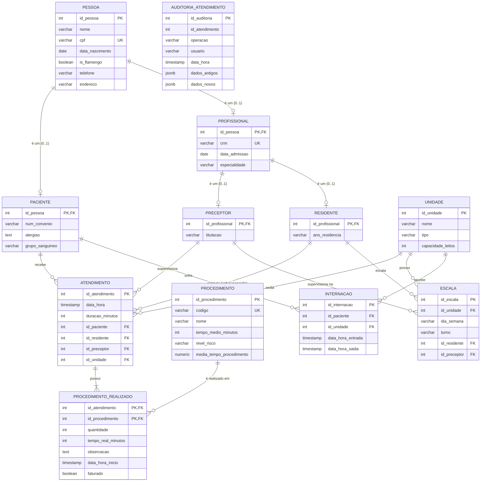

# Documentação do Projeto de Banco de Dados: Sistema de Gestão Hospitalar

Esta documentação contém o **Diagrama de Entidade-Relacionamento (DER)**, o **Modelo Relacional (MR)** e a **Evidência de Normalização até a 3ª Forma Normal (3FN)** do sistema de gestão hospitalar.

---

## 1. Diagrama de Entidade-Relacionamento (DER)

Abaixo está a representação conceitual do banco de dados utilizando a sintaxe Mermaid. 

### Justificativas de Especialização e Cardinalidades

#### Especialização (Herança de Entidades)
O sistema adota uma estrutura de herança para representar os papéis das pessoas envolvidas no hospital:
1. **PESSOA &rarr; PACIENTE / PROFISSIONAL**:
   - **Tipo**: Especialização Exclusiva e Parcial. Uma `PESSOA` pode ser um `PACIENTE`, um `PROFISSIONAL` ou nenhum deles (ex: um visitante ou fornecedor, embora o escopo foque nos dois primeiros). Em um dado momento, a regra de negócio do hospital define que uma pessoa ocupa apenas um papel ativo no sistema.
   - **Implementação Física**: Mapeada via tabela por subclasse (JPA *Joined Table* / Chave Estrangeira Compartilhada como Chave Primária). A tabela `PACIENTE` e a tabela `PROFISSIONAL` possuem `id_pessoa` como PK e FK referenciando `PESSOA`.
2. **PROFISSIONAL &rarr; PRECEPTOR / RESIDENTE**:
   - **Tipo**: Especialização Exclusiva e Total. Todo profissional cadastrado no hospital universitário deve ser ou um `PRECEPTOR` (médico supervisor) ou um `RESIDENTE` (médico residente em formação).
   - **Implementação Física**: Chaves primárias das tabelas `PRECEPTOR` e `RESIDENTE` referenciam `id_pessoa` na tabela `PROFISSIONAL`.

#### Cardinalidades dos Principais Relacionamentos
1. **PACIENTE (1,1) ── (0,N) ATENDIMENTO**:
   - Um atendimento médico ocorre para exatamente **um** paciente cadastrado.
   - Um paciente pode passar por **zero** atendimentos (recém-cadastrado) ou **N** atendimentos ao longo do tempo.
2. **RESIDENTE (1,1) ── (0,N) ATENDIMENTO** e **PRECEPTOR (1,1) ── (0,N) ATENDIMENTO**:
   - Cada atendimento específico é executado por exatamente **um** médico residente sob a supervisão direta de exatamente **um** médico preceptor responsável.
   - Tanto residentes quanto preceptores podem participar de **zero** a **N** atendimentos médicos.
3. **ATENDIMENTO (1,N) ── (0,N) PROCEDIMENTO**:
   - Durante um atendimento, **um ou mais** procedimentos devem ser realizados (suturas, exames, etc.).
   - Um procedimento catalogado no sistema pode ser realizado em **zero** ou **N** atendimentos.
   - *Resolução*: Mapeado pela tabela associativa **`PROCEDIMENTO_REALIZADO`** com cardinalidade (1,1) para ambas as pontas.
4. **UNIDADE (1,1) ── (0,N) ESCALA**:
   - Uma escala de plantão define a alocação de profissionais em exatamente **uma** unidade de atendimento (ex: UTI, Pronto-Socorro).
   - Uma unidade pode conter **zero** ou **N** escalas registradas para turnos e dias da semana específicos.

---

## 2. Modelo Relacional

O modelo relacional lógico detalha as tabelas físicas com seus tipos de dados, chaves primárias (PK), chaves estrangeiras (FK) e restrições de integridade.

### Tabela: `PESSOA`
- `id_pessoa` (INT) **PK** (Serial/Auto-incremento)
- `nome` (VARCHAR(100)) NOT NULL
- `cpf` (VARCHAR(11)) UNIQUE NOT NULL
- `data_nascimento` (DATE) NOT NULL
- `is_flamengo` (BOOLEAN) NOT NULL DEFAULT FALSE
- `telefone` (VARCHAR(20))
- `endereco` (VARCHAR(200))

### Tabela: `PACIENTE`
- `id_pessoa` (INT) **PK, FK** referenciando `PESSOA(id_pessoa)` ON DELETE CASCADE
- `num_convenio` (VARCHAR(50))
- `alergias` (TEXT)
- `grupo_sanguineo` (VARCHAR(5))

### Tabela: `PROFISSIONAL`
- `id_pessoa` (INT) **PK, FK** referenciando `PESSOA(id_pessoa)` ON DELETE CASCADE
- `crm` (VARCHAR(20)) UNIQUE NOT NULL
- `data_admissao` (DATE) NOT NULL
- `especialidade` (VARCHAR(100))

### Tabela: `PRECEPTOR`
- `id_profissional` (INT) **PK, FK** referenciando `PROFISSIONAL(id_pessoa)` ON DELETE CASCADE
- `titulacao` (VARCHAR(50))

### Tabela: `RESIDENTE`
- `id_profissional` (INT) **PK, FK** referenciando `PROFISSIONAL(id_pessoa)` ON DELETE CASCADE
- `ano_residencia` (VARCHAR(2)) CHECK (`ano_residencia` IN ('R1', 'R2', 'R3'))

### Tabela: `UNIDADE`
- `id_unidade` (INT) **PK** (Serial/Auto-incremento)
- `nome` (VARCHAR(100)) NOT NULL
- `tipo` (VARCHAR(50)) CHECK (`tipo` IN ('Enfermaria', 'UTI', 'Pronto-Socorro', 'Ambulatorio'))
- `capacidade_leitos` (INT) NOT NULL CHECK (`capacidade_leitos` >= 0)

### Tabela: `ATENDIMENTO`
- `id_atendimento` (INT) **PK** (Serial/Auto-incremento)
- `data_hora` (TIMESTAMP) NOT NULL
- `duracao_minutos` (INT) NOT NULL CHECK (`duracao_minutos` >= 0)
- `id_paciente` (INT) **FK** referenciando `PACIENTE(id_pessoa)`
- `id_residente` (INT) **FK** referenciando `RESIDENTE(id_profissional)`
- `id_preceptor` (INT) **FK** referenciando `PRECEPTOR(id_profissional)`
- `id_unidade` (INT) **FK** referenciando `UNIDADE(id_unidade)`

### Tabela: `PROCEDIMENTO`
- `id_procedimento` (INT) **PK** (Serial/Auto-incremento)
- `codigo` (VARCHAR(20)) UNIQUE NOT NULL
- `nome` (VARCHAR(100)) NOT NULL
- `tempo_medio_minutos` (INT) NOT NULL CHECK (`tempo_medio_minutos` >= 0)
- `nivel_risco` (VARCHAR(10)) CHECK (`nivel_risco` IN ('BAIXO', 'MEDIO', 'ALTO'))
- `media_tempo_procedimento` (NUMERIC(10,2)) DEFAULT 0.00 *(Calculado via trigger)*

### Tabela: `PROCEDIMENTO_REALIZADO`
- `id_atendimento` (INT) **PK, FK** referenciando `ATENDIMENTO(id_atendimento)` ON DELETE CASCADE
- `id_procedimento` (INT) **PK, FK** referenciando `PROCEDIMENTO(id_procedimento)`
- `quantidade` (INT) NOT NULL CHECK (`quantidade` > 0)
- `tempo_real_minutos` (INT) NOT NULL CHECK (`tempo_real_minutos` >= 0)
- `observacao` (TEXT)
- `data_hora_inicio` (TIMESTAMP) NOT NULL
- `faturado` (BOOLEAN) NOT NULL DEFAULT FALSE

### Tabela: `ESCALA`
- `id_escala` (INT) **PK** (Serial/Auto-incremento)
- `id_unidade` (INT) **FK** referenciando `UNIDADE(id_unidade)`
- `dia_semana` (VARCHAR(15)) CHECK (`dia_semana` IN ('Segunda', 'Terca', 'Quarta', 'Quinta', 'Sexta', 'Sabado', 'Domingo'))
- `turno` (VARCHAR(10)) CHECK (`turno` IN ('Manha', 'Tarde', 'Noite'))
- `id_residente` (INT) **FK** referenciando `RESIDENTE(id_profissional)`
- `id_preceptor` (INT) **FK** referenciando `PRECEPTOR(id_profissional)`
- *Restrição de Unicidade*: `UNIQUE(id_unidade, dia_semana, turno, id_residente)` *(impede duplicidade na mesma escala)*

### Tabela: `INTERNACAO`
- `id_internacao` (INT) **PK** (Serial/Auto-incremento)
- `id_paciente` (INT) **FK** referenciando `PACIENTE(id_pessoa)`
- `id_unidade` (INT) **FK** referenciando `UNIDADE(id_unidade)`
- `data_hora_entrada` (TIMESTAMP) NOT NULL
- `data_hora_saida` (TIMESTAMP) CHECK (`data_hora_saida` IS NULL OR `data_hora_saida` >= `data_hora_entrada`)

### Tabela: `AUDITORIA_ATENDIMENTO`
- `id_auditoria` (INT) **PK** (Serial/Auto-incremento)
- `id_atendimento` (INT)
- `operacao` (VARCHAR(10)) NOT NULL
- `usuario` (VARCHAR(100)) NOT NULL
- `data_hora` (TIMESTAMP) NOT NULL DEFAULT CURRENT_TIMESTAMP
- `dados_antigos` (JSONB)
- `dados_novos` (JSONB)

---

## 3. Evidência de Normalização até a 3ª Forma Normal (3FN)

A normalização de dados é o processo de estruturar tabelas de forma a mitigar redundâncias e anomalias de inserção, atualização e remoção. Justificamos a aderência do nosso esquema físico às três formas normais clássicas:

### Primeira Forma Normal (1FN)
*Regra: Todos os atributos devem conter valores atômicos (não multivalorados e não compostos) e cada tabela deve possuir uma Chave Primária definida.*
- **Valores Atômicos**: Nenhum campo armazena listas de itens complexos ou dados aninhados para fins de queries relacionais. Atendimentos e seus procedimentos são mapeados individualmente através de tuplas na tabela associativa `PROCEDIMENTO_REALIZADO` em vez de um array contido em `ATENDIMENTO`. Campos textuais extensos (como `alergias` e `observacao`) são descrições clínicas textuais indivisíveis sob a ótica operacional do domínio.
- **Chave Primária**: Todas as tabelas possuem PKs estruturadas de forma inequívoca.

### Segunda Forma Normal (2FN)
*Regra: Estar na 1FN e nenhum atributo não-chave depender de forma parcial de qualquer parte de uma chave primária composta (dependência funcional total).*
- **Chaves Simples**: As tabelas `PESSOA`, `PACIENTE`, `PROFISSIONAL`, `PRECEPTOR`, `RESIDENTE`, `UNIDADE`, `ATENDIMENTO`, `PROCEDIMENTO`, `ESCALA`, `INTERNACAO` e `AUDITORIA_ATENDIMENTO` possuem chaves primárias compostas por **apenas um atributo** (IDs inteiros). Em tabelas com chaves primárias simples, a 2FN é atendida por vacuidade matemática (não há subconjunto próprio de atributos de chave primária para gerar dependência parcial).
- **Chave Composta**: A única tabela com PK composta é `PROCEDIMENTO_REALIZADO` (PK: `{id_atendimento, id_procedimento}`).
  - Os atributos não-chave (`quantidade`, `tempo_real_minutos`, `observacao`, `data_hora_inicio` e `faturado`) necessitam funcionalmente da **combinação inteira** da consulta do atendimento e do procedimento executado. Por exemplo, a `quantidade` executada e o `tempo_real_minutos` gasto são fatos concretos da intersecção de um determinado procedimento em um determinado atendimento. Não dependem apenas do procedimento de forma isolada, tampouco apenas do atendimento de forma isolada.
- Logo, o modelo respeita plenamente a 2FN.

### Terceira Forma Normal (3FN)
*Regra: Estar na 2FN e não conter nenhuma dependência transitiva (atributos não-chave não podem depender funcionalmente de outros atributos não-chave, devendo depender apenas e diretamente da chave primária).*
- **Verificação de Tabelas**:
  - `PESSOA`: Todos os dados dependem exclusivamente do `id_pessoa`. CPF é uma chave candidata alternativa (determinante única). Nenhuma propriedade comum (como telefone ou endereço) determina outra propriedade não-chave de pessoa.
  - `PACIENTE`, `PROFISSIONAL`, `PRECEPTOR`, `RESIDENTE`: Os dados específicos dependem de forma única da chave de herança que representa o indivíduo.
  - `ATENDIMENTO`: Os IDs de chaves estrangeiras (`id_paciente`, `id_residente`, `id_preceptor`, `id_unidade`) e os dados de tempo dependem exclusivamente do ID do atendimento. Não há dependências entre as entidades relacionadas dentro da tupla de atendimento (ex: o preceptor do atendimento não é determinado pela unidade do atendimento, nem o paciente determina o residente).
  - `ESCALA`: A tripla ou quádrupla que forma a unicidade operacional de escala (`id_unidade`, `dia_semana`, `turno`, `id_residente`) é resolvida por um ID substituto (`id_escala`) que atua como PK. Não há dependências transitivas (ex: o turno de escala não determina o preceptor).
  - `PROCEDIMENTO`: O `codigo` é único e as colunas dependem diretamente do `id_procedimento`. A coluna `media_tempo_procedimento` é uma coluna derivada que serve como desnormalização controlada por desempenho (mantida em consistência estrita via Trigger de agregação na tabela de ligação), o que não configura infração de normalização conceitual uma vez que ela é atualizada de forma transacional e depende unicamente do id do procedimento.
- Logo, todas as tabelas estão na 3FN.
